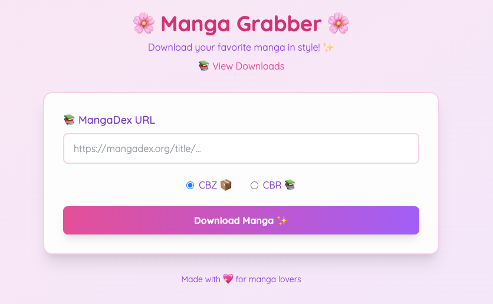
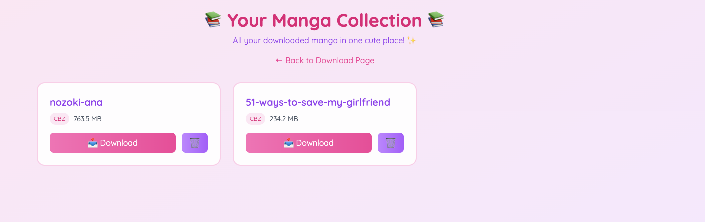

# MangaDex Downloader

A Python tool to download manga from MangaDex and create CBR/CBZ archives with proper volume/chapter organization.

## Features

- Download manga volumes and chapters from MangaDex
- Beautiful web interface with real-time progress tracking
- Support for proxy usage with automatic IP rotation
- Concurrent image downloads with configurable batch size
- Progress tracking with colored output
- Creates properly organized CBR/CBZ archives
- Maintains correct ordering of volumes, chapters, and pages
- Kawaii-styled interface with cute notifications
- Docker support for easy deployment

## Interface

### Download Page

*The main download interface with real-time progress tracking*

### Downloads Manager

*Manage your downloaded manga with cute notifications*

## Docker Installation

### Prerequisites
- Docker
- Docker Compose

### Quick Start
1. Clone the repository:
```bash
git clone https://github.com/WasamiKirua/mangadex-hydra
cd mangadex-downloader
```

2. Build and start the containers:
```bash
docker-compose up --build
```

3. Access the web interface at `http://localhost:5001`

## Docker Compose Configuration

### Basic Usage
```yaml
# Start the application
docker-compose up -d

# Stop the application
docker-compose down

# Rebuild after changes
docker-compose up --build

# View logs
docker-compose logs -f
```

### Development Mode
The default configuration includes:
- Hot-reloading for Python files
- Volume mounts for real-time code changes
- Debug mode enabled
- Persistent manga storage

### Volume Mounts
```yaml
volumes:
  - ./app.py:/app/app.py
  - ./functions.py:/app/functions.py
  - ./main.py:/app/main.py
  - ./templates:/app/templates
  - ./data:/app/data  # Persistent manga storage
```

### Environment Variables
Configure these in `docker-compose.yml`:
```yaml
environment:
  - FLASK_APP=app.py
  - FLASK_ENV=development
  - FLASK_DEBUG=1
  - WITH_PROXY=no
  - BATCH_SIZE=5
```

### Data Persistence
Downloaded manga are stored in the `./data` directory on your host machine:
```
data/
├── manga_name/
│   ├── json/         # API response data
│   ├── volumes/      # Downloaded images
│   ├── cover_art.jpg # Manga cover
│   └── manga_name.cbz/cbr # Final archive
```

### Troubleshooting Docker

1. **Permission Issues**
   ```bash
   # Fix data directory permissions
   chmod -R 755 data/
   ```

2. **Container Won't Start**
   ```bash
   # Check logs
   docker-compose logs
   
   # Rebuild from scratch
   docker-compose down
   docker-compose build --no-cache
   docker-compose up
   ```

3. **Changes Not Reflecting**
   ```bash
   # Restart with build
   docker-compose down
   docker-compose up --build
   ```

4. **Clean Start**
   ```bash
   # Remove all related containers and volumes
   docker-compose down -v
   docker-compose up --build
   ```

## Standard Installation

If you prefer not to use Docker, you can install directly:

1. Create a virtual environment and install dependencies using uv:
```bash
uv venv
source .venv/bin/activate  # On Windows: .venv\Scripts\activate
uv pip install -r requirements.txt
```

## Configuration

Create a `.env` file in the project root with the following settings:

```env
# Proxy settings (optional)
DATA_IMPULSE_LOGIN=your_login
DATA_IMPULSE_PASSWD=your_password
WITH_PROXY=yes  # or 'no' to disable proxy

# Download settings
BATCH_SIZE=5  # Number of concurrent image downloads
```

## Usage

1. Run the script:
```bash
python main.py
```

2. Input the MangaDex manga URL when prompted, or modify the URL variable in main.py
3. The script will:
   - Create necessary directories
   - Download cover art
   - Download volume and chapter information
   - Download all images with progress tracking
   - Create a CBR/CBZ archive (user's choice)

## Project Structure

```
data/
├── manga_name/
│ ├── json/ # API response data
│ ├── volumes/ # Downloaded images
│ ├── cover_art.jpg # Manga cover
│ └── manga_name.cbz # Final archive

```

## Archive Structure

The generated CBR/CBZ will have the following structure:

```
manga_name.cbz/cbr
├── manga_name/
│ ├── cover.jpg
│ ├── Volume_01/
│ │ ├── Chapter_001/
│ │ │ ├── 001.png
│ │ │ ├── 002.png
│ │ │ └── ...
│ │ └── Chapter_002/
│ └── Volume_02/

```

## Dependencies

- requests: HTTP requests
- aiohttp: Async HTTP client
- colorama: Colored terminal output
- python-dotenv: Environment variable management
- tqdm: Progress bars
- patool: CBR archive creation
- zipfile: CBZ archive creation

## Error Handling

- Retries for failed downloads
- Proxy rotation timing
- Comprehensive error messages
- Cleanup of temporary files

## Limitations

- Only works with MangaDex URLs
- Requires proper volume/chapter structure on MangaDex
- CBR creation requires `patool` and appropriate archive tool (rar, 7z, etc.)

## Contributing

Feel free to submit issues and enhancement requests.

## License

[Your chosen license]

## Troubleshooting

### Common Issues

1. **Proxy Connection Errors**
   ```
   Error: NO_HOST_CONNECTION
   ```
   - Verify your proxy credentials in `.env`
   - Check if proxy service is active
   - Try disabling proxy by setting `WITH_PROXY=no`
   - Wait a few minutes as proxy IPs might be rate limited

2. **Rate Limiting**
   ```
   Error: 429 Too Many Requests
   ```
   - Increase delay between requests in `.env`
   - Ensure proxy rotation is working
   - Try reducing `BATCH_SIZE`

3. **Archive Creation Fails**
   ```
   Error creating CBR archive
   ```
   - For CBR: Ensure you have `rar` or `7z` installed on your system
   - For CBZ: Check disk space and write permissions
   - Try using CBZ format instead of CBR

4. **Missing Images**
   ```
   Warning: Failed to copy image
   ```
   - Check network connection
   - Verify MangaDex is accessible
   - Try downloading the chapter again
   - Check if images exist on MangaDex

5. **Memory Issues**
   ```
   MemoryError or system becomes slow
   ```
   - Reduce `BATCH_SIZE` in `.env`
   - Close other memory-intensive applications
   - Try downloading one volume at a time

### Installation Issues

1. **UV Package Manager**
   ```
   Command 'uv' not found
   ```
   ```bash
   curl -LsSf https://astral.sh/uv/install.sh | sh
   ```

2. **Missing Dependencies**
   ```
   ModuleNotFoundError: No module named 'package_name'
   ```
   ```bash
   uv pip install -r requirements.txt
   ```

3. **CBR Creation Tools**
   - Ubuntu/Debian:
     ```bash
     sudo apt-get install rar unrar
     ```
   - macOS:
     ```bash
     brew install rar
     ```
   - Windows:
     - Install WinRAR or 7-Zip

### Environment Setup

1. **Verify .env Configuration**
   ```bash
   cat .env
   ```
   Should show:
   ```
   DATA_IMPULSE_LOGIN=xxxxx
   DATA_IMPULSE_PASSWD=xxxxx
   WITH_PROXY=yes
   BATCH_SIZE=5
   ```

2. **Check Permissions**
   ```bash
   # Linux/macOS
   chmod +x main.py
   chmod -R 755 data/
   ```

### Debug Mode

Add to `.env` for detailed logging:
```env
DEBUG=yes
```

### Recovery Options

1. **Interrupted Downloads**
   - The script will create new directories only if they don't exist
   - Already downloaded images won't be downloaded again
   - You can safely restart the script

2. **Corrupt Archives**
   - Delete the failed archive
   - Remove the `temp` directory if it exists
   - Run `make_cbr_cbz(manga_name)` again

3. **Network Issues**
   - The script includes retry logic
   - Failed downloads are logged
   - Check `data/{manga_name}/json` for missing chapters

### Still Having Issues?

1. Check the logs for specific error messages
2. Verify your internet connection
3. Ensure MangaDex is accessible from your location
4. Try with and without proxy to compare
5. Check system resources (memory, disk space)
6. Verify all dependencies are correctly installed

For persistent issues:
1. Clear the `data` directory
2. Reinstall dependencies
3. Try with a different manga URL
4. Check for script updates
